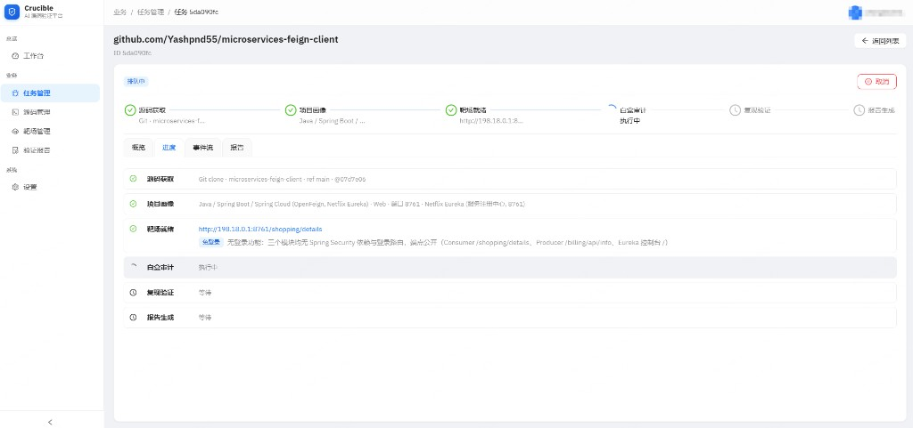
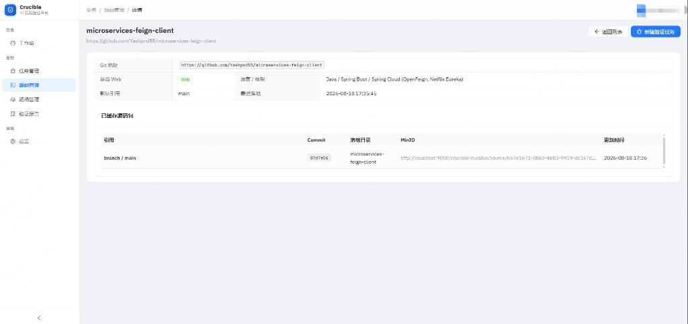
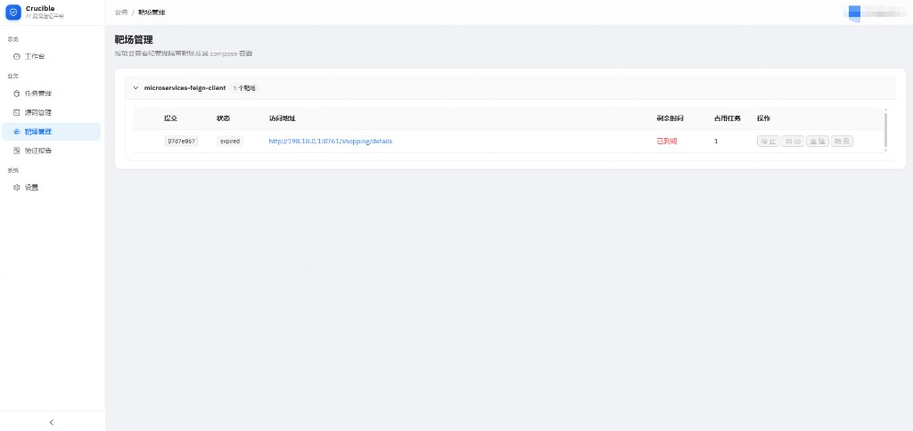

<div align="center">

# Crucible

**AI 辅助代码审计与漏洞挖掘平台**

代码与漏洞投入烈火，真伪自现。

[](https://www.python.org/)
[](https://fastapi.tiangolo.com/)
[](https://react.dev/)
[](https://www.postgresql.org/)
[](https://docs.docker.com/)
[](./LICENSE)

[特性](#平台特色) · [界面](#界面预览) · [架构](#架构) · [快速开始](#快速开始) · [配置](#配置-llm) · [文档](#文档)

</div>

---

## 这是什么

Crucible 是面向安全研究员和研发团队的 **AI 辅助代码审计与漏洞挖掘平台**。

主流程从项目资产发起代码审计；已有明确漏洞线索时，也可以进入定向验证：

| | 代码审计（主入口） | 定向验证（次级入口） |
| --- | --- | --- |
| **你提供** | Git 仓库或源码包及确定版本 | 代码版本 + 已知漏洞描述（可附带 PoC / 分析过程） |
| **平台做什么** | 多引擎扫描、聚类、AI 研判，多条合格线索并发终认 | 读源码、白盒推演，并在可用时进入隔离环境复现 |
| **你得到** | 漏洞线索工作台与完整审计报告；零确认漏洞也出具覆盖报告 | 六档终认结论；确认漏洞可附复现证据 |

判定档位：已确认 / 部分确认 / 代码可达 / CODE SMELL / 误报 / 未复现。

结论由**最强可观察证据**决定：诊断信号（HTTP 500、日志、sink 命中）只说明可达，不能当成「已确认」。

## 解决什么问题

扫描器（SAST / DAST）的输出通常是噪声大于信号：真实可利用漏洞、误报、代码异味混在一起。人工逐条复核贵，直接信扫描器又会漏掉真正能打的洞。

安全研究员真正要的是可解释的**漏洞挖掘与终认**，以及把扫描噪声收成可行动的线索：

1. 这个告警是不是误报？
2. 攻击者能不能实际打出可观察危害？
3. 复现路径和证据是什么？
4. 该怎么修？

终认工位按研究员的方法论自动走完这条链路：

> **白盒优先** —— 先用源码走通调用链、读全每一层防御，把 payload 在纸上推演到「理论可通」，再用一次请求在靶场确认。推演不通即判误报，绝不在靶场上黑盒盲试。

代码审计用确定性引擎做覆盖、用 AI 做封闭二审，再把多条合格线索分别交给同一套终认工位；边界线索进入人工复核。这不是开放式「让 AI 自己找洞」。

## 平台特色

- **审计优先** —— 项目资产、代码审计、漏洞线索、终认、审计报告形成一条主流程
- **多引擎发现漏斗** —— Semgrep / Gitleaks / OSV 扫描、聚类、AI 研判；合格线索并发终认，边界项进入人工复核
- **白盒优先的终认** —— 源码是主战场，运行环境只做最后确认
- **自动搭靶场并复用** —— 为 Web 项目拉起隔离运行环境；同一项目可复用已就绪靶场
- **Agent 在沙箱里跑** —— 分析过程在独立 Docker 容器中执行，与平台进程隔离
- **进度看得见** —— 任务详情实时展示节点进度和 Agent 过程（思考、工具调用、结论）
- **报告与证据可归档** —— 中文结构化报告，证据进对象存储，可导出 JSON / Markdown
- **自己选模型** —— 通过 Anthropic 兼容端点接入 DeepSeek 等；后台配置，设为默认即启用
- **任务可取消、可从失败处续跑** —— 取消会停 Worker 并回收容器；重试复用已完成步骤
- **登录隔离** —— JWT 认证，数据按用户隔离
- **并行任务** —— 设置里指定同时运行上限（Celery prefork，默认上限 4）

## 界面预览

审计详情先展示业务阶段与结果，节点 DAG 和 Agent 事件作为运行诊断信息。



源码按 Git 地址接入，自动识别技术栈，并按 commit 缓存到对象存储。



靶场按项目隔离，提供访问地址与停止 / 启动 / 重建 / 销毁。



## 架构

平台是 **Web 控制台 + 后台 Worker + 隔离 Agent 容器**：

```
浏览器（React）
    │  HTTP + SSE
    ▼
FastAPI  API  ── PostgreSQL
    │           Redis（任务队列 + 实时事件）
    │           MinIO（源码 / 报告 / 证据 / 靶场配方 / 失败节点包）
    ▼
Celery Worker
    ├─ 拉取 / 缓存源码
    ├─ 按节点编排：验证走白盒终认；仓库审计先扫描再终认
    ├─ 每个 AI 节点拉起一只 agent-runner 容器
    └─ 靶场用 Docker Compose 在隔离网络中启动
```

定向验证按这条链路推进（非 Web 项目跳过动态环境，但仍执行白盒审计）：

```
拉取源码 → 项目画像 → 靶场就绪 → 白盒审计 → 靶场复现 → 生成报告
```

代码审计在画像之后执行独立扫描、聚类、AI 研判与调度，再由多个终认工位分别处理合格线索；没有合格线索时跳过终认，但仍生成零漏洞审计报告。

| 节点 | 做什么 |
| --- | --- |
| 源码 | 拿到可分析的代码快照 |
| 画像 | 判断技术栈、是否 Web 应用 |
| 靶场 | 编写或复用运行环境，探活，给出访问方式 |
| 审计 | 只读源码，推演利用链；过不了门禁则判误报 |
| 复现 | 对靶场做有限次确认，给出六档判定 |
| 报告 | 唯一写文档的步骤，落库并归档 |

### 三层隔离

1. **平台** —— API、Worker、数据库、Redis、MinIO
2. **Agent** —— 每个分析步骤一只容器；LLM 凭据只进容器环境变量，容器销毁即消失
3. **审计** —— Agent 输出不可信，校验通过才写入平台

| 层 | 技术 |
| --- | --- |
| 后端 | Python 3.11+ · FastAPI · SQLAlchemy 2.0 · Celery |
| 前端 | React 19 · TypeScript · Vite 6 · Ant Design |
| 数据 | PostgreSQL 16 · Redis 7 · MinIO |
| Agent | Claude Agent SDK，镜像 `crucible-agent-runner:base` |
| 运行 | Docker Compose 起基础设施；Worker 用 Docker 拉起分析容器与靶场 |

## 快速开始

### 前置

- Linux 宿主（含 WSL）；不支持在 Windows 本机直接跑后端 / Worker
- Docker 20+ 与 Docker Compose v2+（WSL 重启后先确认 Docker 已起来）
- Python 3.11+（推荐 3.12）
- Node.js 18+
- 本机可访问 Docker（真实验证模式要拉容器）
- 可选：Anthropic 兼容 LLM 凭据（如 [DeepSeek](https://platform.deepseek.com/)）。没有凭据也能先用 Mock 跑通界面

### 启动

仓库根目录用 `.venv`。三个进程都要开：只开 API 时任务会停在队列里。

```bash
git clone https://github.com/pgnzbl-ux/crucible.git Crucible && cd Crucible
python3.12 -m venv .venv && source .venv/bin/activate

# 1. PostgreSQL + Redis + MinIO（端口仅绑 127.0.0.1；口令见 infrastructure/.env）
cd infrastructure && cp -n .env.example .env && docker compose up -d && cd ..

# 2. 构建 Agent 镜像（首次，或改了 agent-runner / 节点 skill 之后）
#    必须在仓库根目录构建，否则镜像里会缺节点 skill
docker build -f infrastructure/agent-runner/Dockerfile -t crucible-agent-runner:base .

# 3. 后端 API（终端 1）
cd backend
cp .env.example .env
pip install -e ".[dev]"
pip install -r requirements.txt          # semgrep 等扫描依赖
python -m uvicorn app.main:app --host 0.0.0.0 --port 8010 --reload

# 4. Celery Worker（终端 2；缺 gitleaks / osv-scanner / 本地 semgrep 规则树时会写入当前 .venv）
python run_worker.py

# 5. 前端（终端 3）
cd ../frontend
npm install
npm run dev
```

WSL 或机器重启后：先开 Docker，再 `cd infrastructure && docker compose up -d`，然后三个终端分别 activate `.venv`、起 API、Worker、前端。数据卷、`.env`、镜像都还在，不必重装依赖、不必重建 Agent 镜像。

### 访问

| 服务 | 地址 | 说明 |
| --- | --- | --- |
| 控制台 | <http://localhost:5173> | 日常使用入口 |
| API / Swagger | <http://localhost:8010/docs> | 接口文档 |
| MinIO 控制台 | <http://localhost:9001> | `minioadmin` / `minioadmin` |
| PostgreSQL | `localhost:5433` | 用户 `crucible` / 库 `crucible` |
| Redis | `localhost:6380` | Worker 与实时进度 |

打开控制台。库中还没有账号时，登录页会让你创建第一个账号；之后用该账号登录。

```bash
curl http://localhost:8010/health
# {"status":"ok","version":"1.0.1"}
```

后端与前端的细节见 [backend/README.md](backend/README.md)、[frontend/README.md](frontend/README.md)。数据库迁移：

```bash
cd backend && alembic upgrade head
```

<details>
<summary><b>生产部署</b></summary>

生产用同形态部署：基础设施容器 + 宿主机 systemd 托管后端 + Nginx，模板见 [infrastructure/deploy/](infrastructure/deploy/)。

> **后端必须留在宿主机** —— 它要直连 Docker daemon 调度沙箱与靶场，不能装进容器（包括挂 `docker.sock` 的 sidecar）。

</details>

## 配置 LLM

LLM 凭据**只**在控制台「设置 → LLM Provider」里配置，不要写进 `.env`。

`.env` 只负责打开真实 Agent：

```bash
# backend/.env
CLAUDE_AGENT_SDK_ENABLED=true
```

然后：登录 → 设置 → LLM Provider → 新增 → **设为默认**。列表里「默认」才是当前启用的接入点，备用配置不会被任务使用。

| 服务 | Base URL | 模型示例 |
| --- | --- | --- |
| DeepSeek | `https://api.deepseek.com/anthropic` | `deepseek-v4-flash` / `deepseek-v4-pro` |

保存前可点「测试连接」。改默认后立即生效，不用重启进程。

## 使用

**Mock（默认）**：`CLAUDE_AGENT_SDK_ENABLED=false`。不调真实模型，用来确认「创建任务 → 进度 → 报告」整条链路能转。

1. 打开控制台，按页面提示创建账号或登录
2. 在项目资产中选择版本并发起 **代码审计**
3. 在审计详情查看覆盖、阶段进度和漏洞线索
4. 在线索工作台人工复核边界项，必要时发起定向验证；完成后查看审计报告

**真实验证**：打开 `CLAUDE_AGENT_SDK_ENABLED=true`，并在设置里配置**默认** LLM Provider。Worker 会按节点拉起隔离容器做白盒分析与靶场复现。

## 注意事项

**进程与端口**

- 必须同时跑 **API + Worker + 前端**。只开 API 时任务会停在队列里
- **并发与资源**：控制台「设置」可分别调整同时运行任务、全局 AI 容器、单任务线索终认和同靶场复现。超过全局槽位的 AI 会等待；单任务另有 Celery soft/hard wall-clock（默认 3.5h / 4h）防止永久占满 Worker
- `AGENT_RUNNER_CONCURRENCY_LIMIT` 只作为部署硬顶和 Worker prefork 进程数；日常并发不再靠 `.env` 调整。Worker 用 `python run_worker.py`
- 端口刻意避开本机常见占用：API `8010`、前端 `5173`、Postgres `5433`、Redis `6380`、MinIO `9000/9001`（基础设施默认仅监听 `127.0.0.1`）
- Redis 启用 `requirepass`：`backend/.env` 中 `REDIS_URL` / Celery URL 须与 `infrastructure/.env` 的 `REDIS_PASSWORD` 一致（见 `.env.example`）
- `python app/main.py` 默认不是 8010，请用快速开始里的 uvicorn 命令

**数据库**

- 运行时连 Docker PostgreSQL（`DATABASE_URL` 指向 `localhost:5433`）。空库在 API 启动时建表
- 生产同样是 PostgreSQL，并设置足够长的 `AUTH_SECRET`

**真实 Agent**

- 需要本机 Docker，且已构建 `crucible-agent-runner:base`
- 构建必须在**仓库根目录**执行，否则镜像里会缺节点 skill
- 改过 `infrastructure/agent-runner/` 下的 skill 或 Dockerfile 后要重新 build
- 任务会访问公网（拉代码、拉镜像、调 LLM）；请在可接受该行为的环境运行

**凭据与安全**

- LLM API Key 存在平台数据库中（列表只显示掩码）。不要把这个开发实例直接暴露到公网
- 账号存在数据库。只有库中还没有任何用户时，登录页才允许创建第一个账号；之后不能公开自助注册
- 不要把 Key 写进 Dockerfile、compose 或提交到 Git
- Agent 默认非 root、只读根文件系统、去掉全部 Linux capability，并有 CPU / 内存 / 超时上限
- Agent 不能直连平台数据库；其输出校验后才落库
- 发现安全漏洞请按 [SECURITY.md](SECURITY.md) 的流程私密报告

**能力边界**

- 定向验证针对「给定描述的那一个漏洞」；代码审计覆盖引擎和 AI 能触达的点，**不保证**穷尽全库
- 非 Web 项目不会搭动态验证环境，但仍可完成扫描、AI 研判、白盒终认和审计报告
- 靶场起不来（多轮失败）时任务失败，可重试
- Mock 模式的报告不能当作真实审计结果

## 测试

```bash
cd backend
pytest tests -k "not smoke"
python tests/smoke_agent_runner.py   # 需要 Docker
python tests/smoke_sse.py

cd ../frontend
npm run typecheck
npm test
```

后端单元测试使用 sqlite，不连接运行时的 PostgreSQL。细节见 [backend/README.md](backend/README.md)。

## 仓库结构

```text
Crucible/
├── backend/                 # FastAPI API + Celery Worker
│   └── app/contexts/        # Bounded Contexts（task/agent/report/identity/settings/lab/project/finding/discovery）
├── frontend/                # React 19 控制台
├── infrastructure/          # Docker Compose + Agent 镜像 + 部署模板
│   ├── agent-runner/        # Agent 沙箱镜像（node-skills 蒸馏方法论）
│   └── deploy/              # systemd + Nginx 生产模板
├── plugins/                 # 桌面 Claude Code 方法论母本（不进运行镜像）
├── docs/assets/             # 界面截图（其余文档本地维护，不入库）
└── CLAUDE.md                # 给协作 AI 的项目入口
```

## 路线图

- 平台级 API Key / Service Account、OIDC、RBAC、操作审计日志
- 生产部署真机验证（systemd + Nginx 模板已备）
- CI/CD、OpenTelemetry / Sentry
- OpenAPI 生成前端类型

## 文档

| 文档 | 内容 |
| --- | --- |
| [backend/README.md](backend/README.md) | 后端启动、配置、测试 |
| [frontend/README.md](frontend/README.md) | 前端启动、页面、代理 |
| [infrastructure/deploy/README.md](infrastructure/deploy/README.md) | 生产部署（systemd + Nginx） |
| [CLAUDE.md](CLAUDE.md) | 给协作 AI 的项目入口 |
| [.claude/api-contract.md](.claude/api-contract.md) | HTTP API 契约 |

## 参与贡献

欢迎 Issue / PR。工程约定：

- Commit 描述用简体中文，type/scope 用英文（Conventional Commits）
- 新功能 / Bug 修复先写失败测试
- PR 描述含背景 / 改动 / 验证

## License

[MIT](./LICENSE) © 2026 pgnzbl

---

<div align="center">

让 AI 像安全研究员一样验证漏洞，而不是像扫描器一样盲射。

</div>
