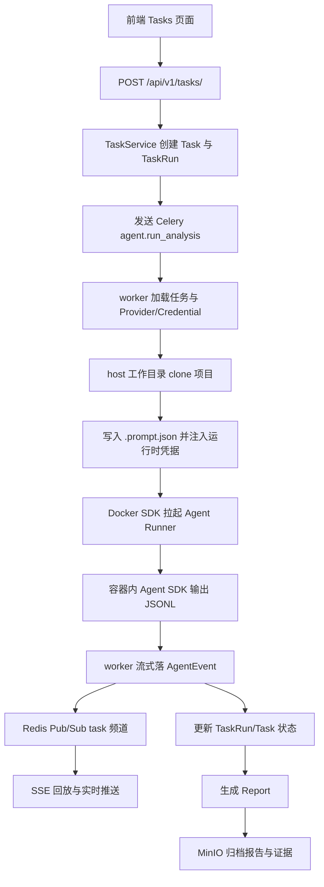

# 项目整体认知报告

> 扫描范围：当前仓库的后端、前端、Agent 插件、容器基础设施、工程文档与测试入口。
>
> 扫描目的：帮助首次接手项目的工程师建立可验证的整体认知。本报告区分已确认事实、合理推断与待确认问题，不替代业务规格或技术方案。

## 1. 一句话概述

Crucible 是一个面向安全研究员的 AI 漏洞验证平台：用户提交项目地址、版本引用和漏洞描述，后端创建异步验证任务，Celery worker 在受控的 Agent Runner 容器中执行白盒分析与复现流程，实时记录 Agent 事件，最终生成报告并将报告产物和证据保存到 MinIO。

**已确认边界：** 当前仓库包含 Web API、管理型前端、异步任务编排、Agent 插件和本地 Docker Compose 基础设施；未发现独立的微服务拆分或独立部署编排。

## 2. 技术栈与运行形态

### 2.1 后端

- Python `>=3.11`。
- FastAPI / Uvicorn：HTTP API、OpenAPI 文档和生命周期管理。
- SQLAlchemy 2.0 Async：异步 ORM；开发默认 SQLite + `aiosqlite`，生产依赖 PostgreSQL + `asyncpg`。
- Celery + Redis：异步 Agent 任务队列、结果后端和 Redis Pub/Sub 事件通道。
- Pydantic v2 / `pydantic-settings`：请求响应模型和环境配置。
- JWT + bcrypt/passlib：登录、用户身份和密码校验。
- Fernet：LLM Provider API Key 与任务凭据加密存储。
- MinIO S3 兼容客户端：报告 artifact 和证据文件对象存储。
- Prometheus FastAPI Instrumentator：HTTP 指标暴露。

### 2.2 前端

- React `19` + TypeScript + Vite `6`。
- Ant Design `5` 与 `@ant-design/icons`：页面和交互组件。
- TanStack Query：服务端数据获取、缓存和 mutation。
- Wouter：轻量路由。
- Zustand 已安装，但当前扫描范围内未确认其承担核心状态管理。
- Vite 开发服务器配置为 `5173`，`/api` 代理到后端 `8010`。

### 2.3 Agent 与插件

- Worker 通过 Docker SDK 拉起 `crucible-agent-runner:base`，不是直接在 API 进程内运行 Agent SDK。
- Agent Runner 容器内使用 Claude Agent SDK，并把消息转换为 JSONL 输出。
- `plugins/vuln-verify-expert` 提供 Agent 定义、搭建项目运行环境和漏洞验证技能，强调白盒优先、证据绑定、受控工具调用和中文报告交付。
- 平台通过环境变量把 LLM Provider 配置注入容器；任务级凭据按环境变量或临时文件注入，目标是容器生命周期内可用、任务结束后清理。

### 2.4 基础设施

`infrastructure/docker-compose.yml` 提供：

- PostgreSQL 16：宿主机 `5433` 映射到容器 `5432`。
- Redis 7：宿主机 `6380` 映射到容器 `6379`。
- MinIO API `9000`、Console `9001`。
- 一次性 `createbuckets` 服务幂等创建报告和证据 bucket。

**已确认运行形态：** 本地开发可以使用 SQLite；完整异步任务链路仍需要 Redis，Agent 生产路径还需要 Docker、Agent Runner 镜像和可用的 LLM Provider。

## 3. 目录结构与模块地图

```text
Crucible/
├── backend/
│   ├── app/main.py                 FastAPI 应用工厂、生命周期、路由注册、健康检查
│   ├── app/core/                   配置、数据库、Celery、Docker Runner、安全、加密、凭据
│   ├── app/shared/                 Base、鉴权依赖、事件总线、SSE
│   ├── app/contexts/identity/      注册、登录、当前用户
│   ├── app/contexts/task/          任务、运行记录、Agent 事件
│   ├── app/contexts/agent/         执行器、SDK 适配、Runner Bridge、Celery 工作流
│   ├── app/contexts/report/        报告、证据、MinIO 存储
│   ├── app/contexts/settings/      LLM Provider、任务级 Credential 配置
│   ├── alembic/                    Alembic 环境入口
│   └── tests/                      Agent Runner 与 SSE 手写冒烟脚本
├── frontend/src/
│   ├── app/                        Providers、布局
│   ├── pages/                      Dashboard、登录、任务、报告、设置页面
│   └── shared/                     API 类型与请求封装、任务 SSE Hook、元信息
├── plugins/vuln-verify-expert/     漏洞验证 Agent 与 Skills、参考材料、脚本、测试
├── infrastructure/                Compose 基础设施与 Agent Runner 镜像/入口
├── docs/                           开发指导和 Agent 工作流设计
└── .claude/                        API 契约、工程规则、技能和专项开发约定
```

### 3.1 Context 划分

后端采用模块化单体，Context 内部基本遵循 `api → service → repository → model/schema`：

- `identity` 负责用户注册、登录、JWT 解析和当前用户查询。
- `task` 负责漏洞验证任务、TaskRun 状态、AgentEvent 历史事件和取消操作。
- `agent` 是执行平台能力，负责把任务上下文转为 Runner 规格、注入运行时环境、消费 Agent 流、更新运行状态和触发报告生成。
- `report` 负责报告生成、发布、证据上传与列表，以及 MinIO 访问。
- `settings` 负责 LLM Provider CRUD、连接测试、默认 Provider，以及 Credential CRUD 和任务引用解析。

## 4. 启动入口与主执行链路

### 4.1 API 启动链路

- `backend/app/main.py` 创建 FastAPI 应用。
- lifespan 在开发 SQLite 环境初始化数据库，并尝试从环境变量幂等种子化 LLM Provider；关闭时释放数据库连接。
- 路由以 `/api/v1` 为前缀，挂载 `auth`、`tasks`、`reports`、`settings` 四组 API。
- `/health` 提供健康状态，`/metrics` 由 Prometheus Instrumentator 暴露。
- 直接运行入口使用 Uvicorn `8000`；前端 Vite 代理目标配置为 `8010`，二者需要在实际启动方式中保持一致或显式覆盖。

### 4.2 创建任务到报告链路



### 4.3 关键执行步骤

1. `TaskService.create_task` 创建任务和首次运行记录，提交 Celery 任务；Broker 不可用时保留任务记录。
2. `agent/tasks.py` 在 worker 中加载 Task，进行 Provider、Runner 镜像和凭据预检，准备临时工作目录并 clone 源码。
3. `sdk_adapter.py` 构造容器环境变量和 prompt 载荷；`credential_proxy.py` 将凭据注入 env 或临时 `.secrets` 文件。
4. `runner_bridge.py` 组合 `AgentRunnerSpec`，`agent_runner.py` 通过 Docker SDK 管理容器生命周期和流式输出。
5. `runner/run_one.py` 在容器中调用 Agent SDK，执行权限/工具控制，并以 JSONL 输出统一事件。
6. worker 将事件写入 `AgentEvent`，同时发布到 `task.{task_id}.events`；SSE 先读数据库历史，再订阅 Redis 实时消息并发送心跳。
7. Agent 完成后根据结论和事件生成报告，报告产物写入 MinIO；任务结束时清理容器和 host 临时目录。

## 5. 核心业务与模块职责拆解

### 5.1 身份与访问控制

- 注册与登录通过 `/api/v1/auth/register`、`/api/v1/auth/login` 完成。
- JWT 由后端签发，前端保存在 `localStorage`，请求封装自动附加 Bearer Token；收到 `401` 时清理本地 token 并跳转登录页。
- 任务列表和报告列表使用当前用户身份过滤。
- 任务 SSE 因浏览器原生 EventSource 无法自定义请求头，使用查询参数携带 token 的约定（具体后端依赖行为需继续核验）。

### 5.2 任务与状态

- 任务支持创建、列表、详情、事件历史和取消。
- 任务创建返回 `202`，表示异步处理。
- 取消流程先校验状态，再取消活跃 Run、revoke Celery 任务，最后把 Task 标为 `cancelled`；容器清理有信号钩子和 stale 清理作为保险。
- TaskRun 保存执行时间、错误信息和运行状态；AgentEvent 保存事件类型、序号、载荷、来源和创建时间。

### 5.3 报告与证据

- 报告由 Agent 结论、推理文本和事件统计生成，状态设计为 `draft → generated → published`。
- 报告生成后尝试归档 JSON artifact；对象存储归档失败目前不会阻断报告创建。
- 证据上传通过 multipart 接口，单文件上限为 `50MB`，白名单约束证据类型，并返回预签名下载 URL。
- 前端报告页通过任务列表反查报告，而不是扫描到独立的报告分页 API 调用细节；这意味着报告规模增大时需要关注请求数量和分页效率。

### 5.4 设置与运行时配置

- LLM Provider 支持增删改、启用/默认激活、连接测试和 API Key 掩码展示。
- API Key 使用 Fernet 加密后落库；生产环境要求显式配置加密 Key。
- Credential 支持 `env_var` 与 `file` 两种注入形式，任务通过引用 ID 使用，服务端按 owner 校验。
- `.env.example` 提供开发默认配置，其中包含示例凭据和本地服务地址；真实 `.env` 被忽略，不应提交真实密钥。

## 6. 配置、数据与外部集成

### 6.1 配置来源

`backend/app/core/config.py` 通过 `pydantic-settings` 读取环境变量，关键配置包括：

- 数据库：`DATABASE_URL`。
- Redis/Celery：`REDIS_URL`、`CELERY_BROKER_URL`、`CELERY_RESULT_BACKEND`。
- 鉴权与管理员：`AUTH_SECRET`、管理员邮箱/密码、JWT 过期时间。
- Agent/LLM：SDK 开关、模型、端点、超时、Runner 镜像、CPU/内存/网络、并发和总超时。
- 对象存储：MinIO endpoint、访问凭据、bucket。
- CORS、Sentry 和运行环境。

### 6.2 数据访问

- ORM 模型由共享 `Base` 注册；主应用生命周期通过 `init_db()` 支持开发 SQLite 自动建表。
- Alembic 环境入口存在，但在本次扫描中未发现 `backend/alembic/versions/` 下的迁移版本文件。
- worker 使用独立 `NullPool` 异步引擎，以规避 Celery/asyncio event loop 之间连接复用问题。
- 数据库模型主要覆盖 users、tasks/task_runs/agent_events、reports/evidences、LLM providers 和 credentials；完整字段约束应以模型与数据库实际状态为准。

### 6.3 外部依赖与接口

- Redis：Celery 队列、结果后端和 SSE 事件发布。
- PostgreSQL/SQLite：业务数据与事件历史。
- MinIO：报告和证据对象。
- Docker Engine：Agent Runner 隔离执行。
- Anthropic 兼容 LLM endpoint：实际 Agent 推理与 Provider 连接测试。
- Prometheus：HTTP 指标。

## 7. 测试与交付现状

### 7.1 已确认测试

- `backend/tests/smoke_sse.py`：覆盖 SSE 帧、历史回放、Redis 发布转发和断开检测等冒烟场景。
- `backend/tests/smoke_agent_runner.py`：Agent Runner 相关全链路冒烟入口。
- `plugins/vuln-verify-expert/skills/vuln-verify/tests/`：针对插件脚本的 Python 单元/集成测试，主要覆盖 Markdown 行内解析和 Markdown 到 DOCX 集成。
- 前端本次扫描未发现项目自有的 `*.test.*` 或 `*.spec.*` 测试文件；发现的测试路径属于依赖包。

### 7.2 工程化现状

- 后端 `pyproject.toml` 已配置 pytest、pytest-asyncio、ruff，测试目录指向 `backend/tests`。
- 前端有 `typecheck`、`build` 脚本，TypeScript 为严格模式；未确认存在前端单元测试和端到端测试配置。
- `.claude/rules/` 已提供后端、前端、API、并发、安全、性能、监控、验证和测试规则；`.claude/api-contract.md` 提供接口契约参考。
- Docker Compose 提供本地基础设施，但本次只读扫描未执行服务启动、数据库连通性或 HTTP 冒烟，因此运行状态未作结论。
- 本次没有执行 lint、typecheck、构建或测试；报告只描述工程现状，不把未执行的验证写成通过。

## 8. 明显风险与复杂区域（架构坏味道与技术债）

以下项目是基于已读代码和配置确认的风险，严重程度仍需结合部署环境与业务要求评估。

### 8.1 高优先级风险

1. **迁移资产不完整或未纳入当前仓库。** Alembic 环境存在但未发现版本文件；当前主要依赖开发环境自动建表和近期代码中的幂等初始化逻辑。生产升级、回滚和结构变更的可追溯性需要补强。
2. **生产安全配置依赖启动时约束。** `AUTH_SECRET`、加密 Key、LLM/API、MinIO 凭据均由环境变量驱动；必须确认生产配置校验是否覆盖所有敏感字段，并避免示例默认值进入生产。
3. **Agent 执行链路跨边界较多。** Celery、asyncio、Docker SDK、容器 stdout JSONL、数据库和 Redis Pub/Sub 共同参与一个任务；事件重复、丢失、顺序、超时、取消和资源清理都属于高风险回归区域。
4. **安全控制集中在 Runner 入口和容器配置。** `run_one.py` 的工具控制、Bash 黑名单、Docker 网络、文件挂载和凭据注入共同决定隔离边界；黑名单策略、允许工具集合、容器用户权限和网络策略应进行专门安全审查。
5. **报告/证据访问控制需要系统化核验。** 部分报告读取接口没有在路由层显式传入当前用户依赖，虽然 repository/service 可能有不同的过滤策略；需要确认任意报告 ID 是否可能跨用户读取或发布。

### 8.2 中优先级风险

6. **错误处理存在“继续运行但弱化可见性”的路径。** 例如启动时 Provider seed、报告 artifact 归档、Redis 发布和 SSE 历史回放失败会记录或吞掉错误；需要区分符合业务契约的降级与应当阻断的完整性错误。
7. **报告列表前端可能存在 N+1 请求。** 页面从任务列表逐条获取报告，任务数增长后会放大后端压力和首屏等待。
8. **前后端端口约定存在不一致证据。** API 直接运行入口使用 `8000`，Vite 代理配置目标是 `8010`；必须以实际启动脚本、部署配置或运行输出确定哪一个是规范端口。
9. **前端 SSE 事件协议耦合较紧。** 事件去重依赖 sequence，原生 EventSource 的事件监听与服务端自定义 event 类型需要保持一致；重连期间的历史回放、实时消息交错和 `Last-Event-ID` 尚未确认有完整处理。
10. **前端测试和 API 类型生成能力不足。** 当前 API 类型为手工维护，未确认 OpenAPI 到 TypeScript 的自动同步；前端缺少项目自有单测/组件测试和端到端回归。

### 8.3 低优先级或维护性问题

11. **仓库存在生成/缓存类文件迹象。** 扫描树中看到若干 `__pycache__` 文件和 `crucible.egg-info`，需要确认它们是否被版本控制以及构建清理边界是否明确。
12. **职责边界仍有少量跨 Context 直接引用。** Agent 工作流直接导入多个 Context 的模型、仓储和服务，这是模块化单体早期常见做法，但会增加后续拆分或独立测试的耦合成本。
13. **全局单例和模块导入时初始化较多。** 配置、Redis、MinIO 和加密对象在模块导入或首次调用时建立；测试隔离、配置切换和多 worker 行为需要额外关注。

## 9. 建议的阅读顺序

1. `README.md`：先了解项目定位、快速启动和当前版本边界。
2. `docs/development-guide.md`：读取架构原则、决策和路线背景。
3. `docs/agent-workflow.md`：理解 S0-S10 阶段编排与分支出口。
4. `backend/app/main.py`：确认 API 应用、生命周期和路由入口。
5. `backend/app/core/config.py`、`database.py`、`celery_app.py`：掌握配置、数据和异步任务基础。
6. `backend/app/contexts/task/api.py`、`service.py`、`repository.py`、`models.py`：理解任务状态和 API 语义。
7. `backend/app/contexts/agent/tasks.py`：沿 Celery 任务完整阅读主执行链路。
8. `backend/app/contexts/agent/executor.py`、`runner_bridge.py`、`sdk_adapter.py`、`backend/app/core/agent_runner.py`：理解执行器、容器编排和流式事件。
9. `infrastructure/agent-runner/runner/run_one.py`：核对容器内权限控制和事件协议。
10. `backend/app/shared/events.py`、`sse.py` 与 `frontend/src/shared/hooks/useTaskEvents.ts`：核对实时事件闭环。
11. `backend/app/contexts/report/`、`settings/`、`identity/`：补齐报告、凭据和认证边界。
12. `frontend/src/shared/lib/api.ts` 与 `frontend/src/pages/`：理解用户侧页面工作流。
13. `infrastructure/docker-compose.yml`、Agent Runner Dockerfile、插件 Skills：最后核对实际运行依赖和 Agent 行为约束。

## 10. 待确认问题清单

1. 生产环境数据库结构由哪套流程维护？Alembic 版本文件是否在其他分支、外部目录或运行时生成？
2. 后端标准启动端口是 `8000` 还是 `8010`？当前前端 Vite 代理配置与后端入口不一致是否为已知约定？
3. Agent Runner 的 Docker 网络、宿主机 Docker socket 权限和容器用户设置在生产部署中如何配置？
4. Agent Runner 是否保证源码 clone、`.prompt.json`、`.secrets` 和输出 artifact 在不同任务间完全隔离？
5. 任务、报告、证据、Provider 和 Credential 的 owner 隔离是否都经过 API 级测试？
6. Redis Pub/Sub 断线、worker 重启、事件重复和 SSE 重连时，sequence 是否足以保证最终一致？
7. `agent.completed` 缺失、容器超时、SIGTERM/SIGKILL、LLM 流中断和报告归档失败分别应呈现什么业务状态？
8. 是否需要把报告 artifact 归档失败从可降级问题升级为任务失败或 `needs_review`？
9. 前端是否计划引入 OpenAPI 类型生成、单元测试、组件测试或端到端测试？
10. 当前 `.claude` 规则、根目录 `CLAUDE.md` 与 `docs/development-guide.md` 之间是否存在重复或冲突约定？
11. 生产部署是否有 CI/CD、镜像版本固定、备份恢复、监控告警和日志保留方案？
12. 插件工作流中“只读源码”和“允许搭靶场/发送请求”的边界，是否通过平台权限而不只依赖提示词与 Runner 黑名单保证？

## 11. 风险点清单

| 编号 | 风险点 | 影响 | 建议优先级 |
|---|---|---|---|
| R-01 | Alembic 环境存在但未见版本迁移 | 生产 schema 演进、回滚和审计不可控 | P0 |
| R-02 | Agent 任务跨 Celery/asyncio/Docker/Redis/DB | 取消、超时、事件一致性和清理容易出现边界故障 | P0 |
| R-03 | Runner 工具权限与 Bash 黑名单决定安全边界 | 误放行可能扩大 Agent 破坏面 | P0 |
| R-04 | 凭据注入、临时目录和容器挂载跨多个模块 | 凭据泄露或跨任务污染 | P0 |
| R-05 | 报告读取/发布 owner 校验需核验 | 可能造成跨用户数据访问 | P0 |
| R-06 | 敏感配置和生产默认值依赖环境治理 | 鉴权、加密、LLM 和对象存储暴露 | P1 |
| R-07 | 报告 artifact、Redis、SSE 的失败降级规则分散 | 用户可能看到不完整但看似成功的结果 | P1 |
| R-08 | 报告页按任务逐条查询报告 | 数据规模增大后性能下降 | P1 |
| R-09 | 前后端端口配置不一致 | 本地启动后 API 请求失败 | P1 |
| R-10 | 前端缺少项目自有测试，API 类型手工同步 | 回归和契约漂移难以及时发现 | P1 |
| R-11 | 模块间直接导入模型/服务、全局单例较多 | 测试隔离与未来拆分成本增加 | P2 |
| R-12 | 缓存/构建产物边界需进一步确认 | 仓库噪声和可复现构建风险 | P2 |

---

## 扫描结论

项目已经具备一条较完整的“提交任务 → Agent 容器执行 → 事件流 → 报告/证据归档”纵向链路，当前最需要优先确认的是生产 schema 迁移、Agent 隔离与权限边界、跨用户访问控制，以及异步任务取消/事件一致性。现有开发文档对目标架构描述较清晰，但部分关键保证仍主要由代码约定、配置和冒烟脚本承载，尚未看到同等强度的自动化契约测试或生产交付证据。

本报告只记录 B-1 认知扫描结果，未修改业务源代码，未执行部署、测试、lint、typecheck 或数据库操作。
